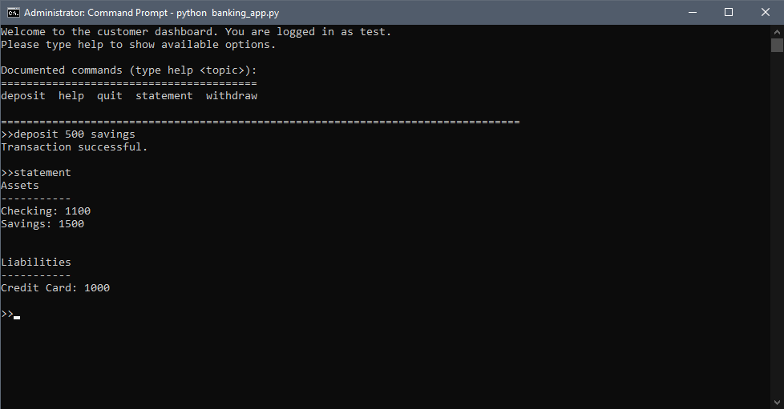
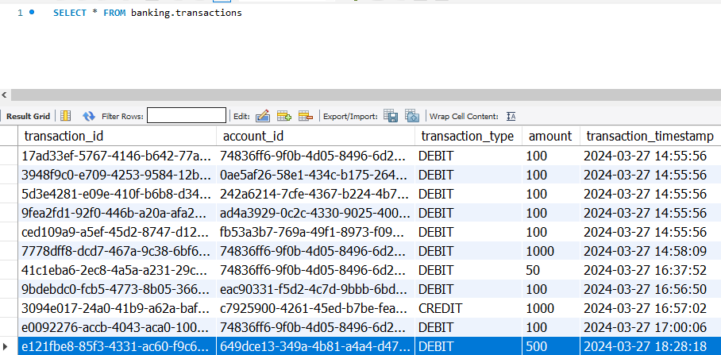

# OOP Banking Project
Python mini-project to create a simple banking model using OOP techniques, data retrieval methods, program logging, and unit testing. The project deliverable is in the form of a user-facing command line interface application that allows for execution of basic tasks such as viewing account balances and performing deposit/withdrawl transactions.

### Prerequisites
All modules in the development environment are included in this project's <tt>requirements.txt</tt> file. This project also requires access to a mySQL database using <tt>mysql-connector-python</tt>. The project requires that credentials for this database be stored in a <tt>.env</tt> file stored in the project's <tt>src</tt> directory.

### How to Use
After satisfying requirements, first run <tt>src/db_init.py</tt> to create a new <tt>banking</tt> database and load test data. This will generate the following tables:

- <tt>individuals</tt>
- <tt>accounts</tt>
- <tt>transactions</tt>
- <tt>employees</tt>

From here, run <tt>src/banking_app.py</tt> to run the command line application. This application allows the user to create/login to customer accounts and perform transactions using on-screen instructions.

These changes will update the project database, which can be verified through SQL:

### Folder Structure

- <tt>src</tt> : Holds required Python scripts for classes and application
- <tt>docs</tt> : Additional documentation and UML Diagram
- <tt>tests</tt> : Unit tests
- <tt>logs</tt> : Logging of application process